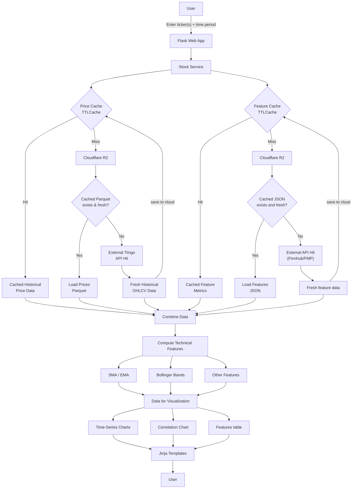

# Stock Analytics Platform

A web application written in Python, leveraging the Flask framework.


## Overview

This web application receives user-inputted market tickers (AAPL, NVDA, etc.), a designated timeframe (6 months, 1 year, etc.) and displays the following:

* Current (or most recent daily) price, change, and change percentage
* Correlation matrix with respect to asset returns for the provided companies over the provided timeframe
* Table with 5-year monthly beta, market cap, trailing & forward price-to-earnings ratios, and upcoming earnings date (if applicable)
* time-series price graphs with share price, 10, 50 and 200-day simple and exponential moving average prices, and upper and lower Bollinger bands

Graphics are plotly express images, easily downloadable to share or use elsewhere (hover over a graphic and a host of options appear near the top right). The time-series charts are interactive, allowing users to toggle metrics on and off and to hover over charts for specific prices.

## Project Structure
```
stock-flask-dash/
├── cache.py
├── storage.py
├── get_data.py
├── web_content.py
├── main.py
├── Procfile
├── providers
│   ├── fh.py
│   ├── fmp.py
│   └── tiingo.py
├── pyproject.toml
├── README.md
├── requirements.txt
├── static
│   └── styles.css
├── templates
│   └── index.html
└── uv.lock
```

## System Design
This web application initially used yfinance for market information, yet that method turned out to be far too unreliable. Yfinance blocks the majority of cloud IP addresses, rendering the Render-deployed app spotty at best. Rather than deploy the project elsewhere, the data sources were adjusted, with yfinance fully replaced with a combination of Finnhub, Financial Modeling Prep (FMP) and Tiingo.

To abide the API limits set by the new data providers and optimize the user experience, caching and cloud storage are implemented. This strips away unnecessary API requests and ensures that API responses are only necessary when the stored data is either outdated or not yet present. Cloudflare R2 storage is leveraged, storing company historical prices in parquet files and features (everything except the prices) in JSON files. The prices are retained in the cache for 24 hours and the features for 30 minutes. 




## Definitions
**Beta ($\beta$)** : a metric that indicates a stock's volatility of returns relative to the rest of the market (S&P 500 typically). The higher the $\beta$, the greater the risk, but also the greater the possible return. Another way of thinking about $\beta$ is the sensitivity of a stock due to market changes. High $\beta$, more sensitive and unstable. Low $\beta$, less sensitive and less risky. A $\beta$ of 1, the stock's price activity correlates with the broader market. The formula to compute $\beta$ is shown below:

$$\beta = \frac{covariance(R_s, R_m)}{variance(R_m)}$$

$R_s$: return on the individual stock

$R_m$: return on the overall market

---
**Simple Moving Average (SMA) & Exponential Moving Average (EMA)**: methods to smooth historical price movements to identify trends. If computing the 10 day SMA and EMA of a stock, the SMA calculation simply involves summing up the stock's prices for the last 10 days and dividing by 10. It is, by definition, a *simple* average. EMA weighs more recent prices more heavily, so yesterday's price has more of an impact on the EMA than the price 10 days ago. Hence, the EMA is more reactive to the latest price changes and is typically a more attractive metric to traders than the SMA. Common SMA and EMA time periods include 10-day, 20-day, 50-day, and 200-day.

---
**Bollinger Bands (BB)**: tool that helps to gauge whether a stock is overvalued or undervalued. The upper and lower BBs are displayed on a price chart and represent the values 2 standard deviations above and 2 standard deviations below the 20-day SMA. The upper and lower bands tend to widen when a stock's price is more volatile and contract when the price is more stable. When comparing a stock's current price to the BBs, if the price approaches the upper BB it *may* be overbought. Subsequently the stock *may* be oversold if it approaches the lower BB, potentially signifying a good time to purchase.


## Disclaimer
Everything on this website is not considered financial advice. Trade at your own risk.

