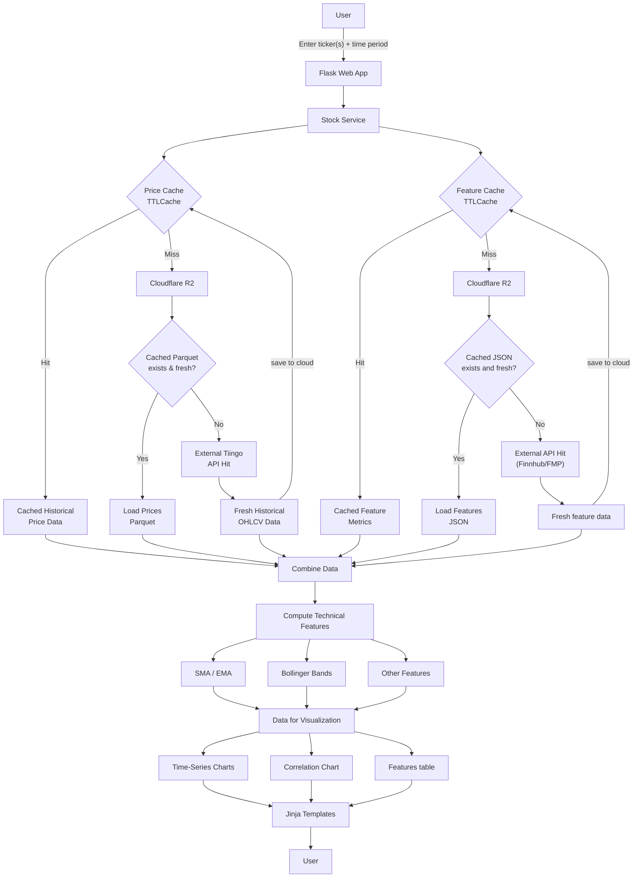

# Stock Analytics Platform

A web application written in Python, leveraging the Flask framework.


## Overview

This web application receives user-inputted market tickers (AAPL, NVDA, etc.), a designated timeframe (6 months, 1 year, etc.) and displays the following:

* Current (or most recent daily) price, change, and change percentage
* Correlation matrix with respect to asset returns for the provided companies over the provided timeframe
* Table with 5-year monthly beta, market cap, trailing & forward price-to-earnings ratios, and upcoming earnings date (if applicable)
* time-series price graphs with share price, 10, 50 and 200-day simple and exponential moving average prices, and upper and lower Bollinger bands

Graphics are plotly express images, easily downloadable to share or use elsewhere (hover over a graphic and a host of options appear near the top right). The time-series charts are interactive, allowing users to toggle metrics on and off and to hover over charts for specific prices.

## Project Structure
```
stock-flask-dash/
├── cache.py
├── storage.py
├── get_data.py
├── web_content.py
├── main.py
├── Procfile
├── providers
│   ├── fh.py
│   ├── fmp.py
│   └── tiingo.py
├── pyproject.toml
├── README.md
├── requirements.txt
├── static
│   └── styles.css
├── templates
│   └── index.html
└── uv.lock
```

## System Design
This web application initially used yfinance for market information, yet that method turned out to be far too unreliable. Yfinance blocks the majority of cloud IP addresses, rendering the Render-deployed app spotty at best. Rather than deploy the project elsewhere, the data sources were adjusted, with yfinance fully replaced with a combination of Finnhub, Financial Modeling Prep (FMP) and Tiingo.

To abide the API limits set by the new data providers and optimize the user experience, caching and cloud storage are implemented. This strips away unnecessary API requests and ensures that API responses are only necessary when the stored data is either outdated or not yet present. Cloudflare R2 storage is leveraged, storing company historical prices in parquet files and features (everything except the prices) in JSON files. The prices are retained in the cache for 24 hours and the features for 30 minutes. 

